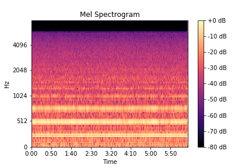

# Anomalous Sound Detection for predictive maintenance of industrial machines

## Description

This project is a part of the Becode.org AI Bootcamp programme. The goal is to investigate the implementation of Machine Learning anomalous to detect anomalous sound detection in industrial machines for a fictional company Acme Corporation. The training data can be consulted [here](https://github.com/mokegg/machine-monitoring-conditions). The has two parts:

 1. To develop a model based on a supervised learning (classification)
    This part was workedout by a team of Mekonnen G. Gebrehiwot and Katarzyna Pranke (AI Diagnostics).
 2. To develop a model based on a unsupervised learning (clustering)

## Explorative data analysis
Acoustic data samples for 4 machine elements are given. Audio samples are recorded at three different signal to noise ratios (-6dB, 0dB, 6dB). Initial analysis is based on 6dB. This is because there is less noise in the data as compared to the other recordings. In addition, there are 4 models per each machine element. Moreover, it has been noticed that the data for abnormal sounds is undersampled.

 

## Feature Extraction
The features used to train the ML model are Mel Frequency Cepstral Coefficents (MFCCs). They are features that combine the time-domain and frequency domain features of the sound wave. The MFCC uses the MEL scale to divide the frequency band to sub-bands and then extracts the Cepstral Coefficents using Discrete Cosine Transform (DCT). MEL scale is based on the way humans distinguish between frequencies which makes it very convenient to process sounds.

## 1. Supervised Learning (Classification)
The AI model was trained with 70% of the data, 15% of data used for testing, and 15% for validation. Different classifier algorithms were explored. Using RandomForestClassifier, F1-score of 0.98 was achieved.

## 2. Unsupervised Learning (Clustering)

## Description
This is a second part of the `Machine conditions monitoring` learning project at Becode.org AI Bootcamp programme. The goal of this particular project is to investigate the possible use of unsupervised learning based on clustering for anomalous sound detection of faulty industrial machinery for a fictional company Acme Corporation. The first project dealt with classification of labeled data and can be consulted [here](https://github.com/mokegg/machine-monitoring-conditions).

Data samples of normal and abnormal sounds of for kinds of machines, valves, pumps, fans and sliders are downloaded from [Machine Condition Monitoring](https://zenodo.org/record/3384388#.YbIcwZHMJH5).

Duration of the project: 2 weeks

## Learning Objectives

  * Be able to work and process data from audio format
  * Find insights from data, build hypothesis and define conclusions
  * Build machine learning models for predictive classification and Clustering  and select the right performance metrics for the model
  * Evaluate the distribution of data points and evaluate its influence in the model
  * Be able to identify underfitting or overfitting that might exist on the model
  * Tuning parameters of the model for better performance
  * Select the model with better performance and following your customer's requirements
  * Define the strengths and limitations of the model

## Installation
The environment at which the code is developed is provided in the `requirements.txt` file. To run the code, the necessary libraries should be installed  based on that environment. Important libraries are, among others:

  *  Numpy
  *  Pandas
  *  Sklearn
  *  Librosa
  *  Soundfile
  *  IPython
  
 
## Usage
Sound files are downloaded and preprocessed using the same codes developed during the first part of the project. This part focuses on the implementation of the clustering techniques. This is implemented by a new code `Clustering.ipynb `

 `Clustering.ipynb ` 
  
  * Imports the preprocessed labeled data, removes the labels to make it suitable for unsupervised learning. 
  * Extracts principal components (main dimensions of variation) using PCA
  * Calculates distortion (Inertia) to estimate the range of the number of clusters
  * Uses two clustering algorithms (KMeans and DBSCAN) to make cluster
  * Compares the clusters formed using unlabeld data with the given labeld data for verification

## Visualizations and Validation
Evaluation the performance of the clustering algorithm was done by using the human-labels that are included in the original data. using barplots, the clusters are shown using expected Targets(labels). Some visuals are shown below.

Valves of a single model (6dB and ID_06) two clusters (KMeans)             |  Comparison with labeld data
:-------------------------:|:-------------------------:
 |  

Valves of a single model (6dB and ID_06) three clusters (KMeans)             |  Comparison with labeld data
:-------------------------:|:-------------------------:
 |  

##Conclusion
From what has been observed during limited investigation, it seems that clustering could help to detect anomalous sounds of faulty machines. However, there are a lot of overlaps between the clusters and more investigation with other algorithms. 

## Further Development
  * The audio features used for clustering are mfccs, same features used in supervised learning. An incomplete attempt was done to include other features to investigate the effects of using different features. Hopefully this will be implemented in the feature.
  * Performance is evaluated only visualy.Performance metrics should be implemented
